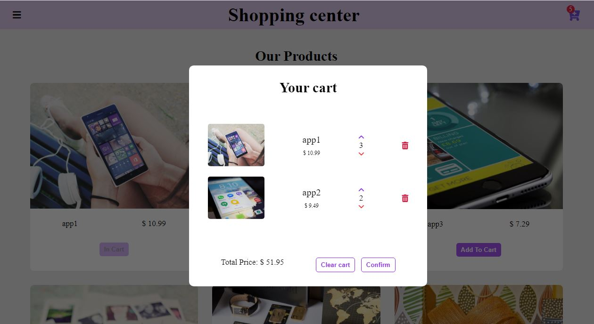
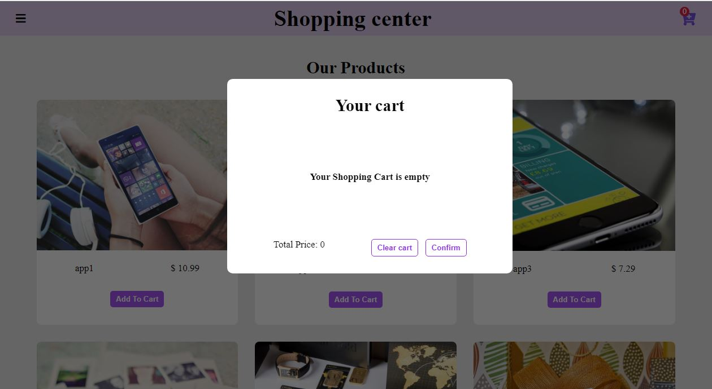

# Shopping-cart

 This Project is written by Mahsa Tabesh

* you can buy each product by clicking on "Add To Cart" button.  
* click on basket shopping and see your information of shopping and update the shopping cart .
* when you refresh the page the information of shopping are not removed and are saved in local storage.

when you click on "Add To Cart " button , it's status changes to inactive and it's wriiten changes to "In Cart". 
 Shopping cart updates and your number of products in shopping basket changes simultaneously.
 

when you click on shopping basket, your cart window is opened. Then you can see your information of shopping and total price of your shopping.
the background will be darker so your cart window will be more clear for users.

you can click on trash icon and up and down arrows for removing, increasing and decreasing of products respectively. And the total Price and the value of basket shopping is updated simultaneously.

you can click on confirm for confirmig the shopping and closing "your Cart" window . At the same time the background will be back to initial state.

you can click on clear cart for removing all of shopping . At the Same Time the value of basket shopping updates  and the "Add To Cart" button will be active again for clicking.

